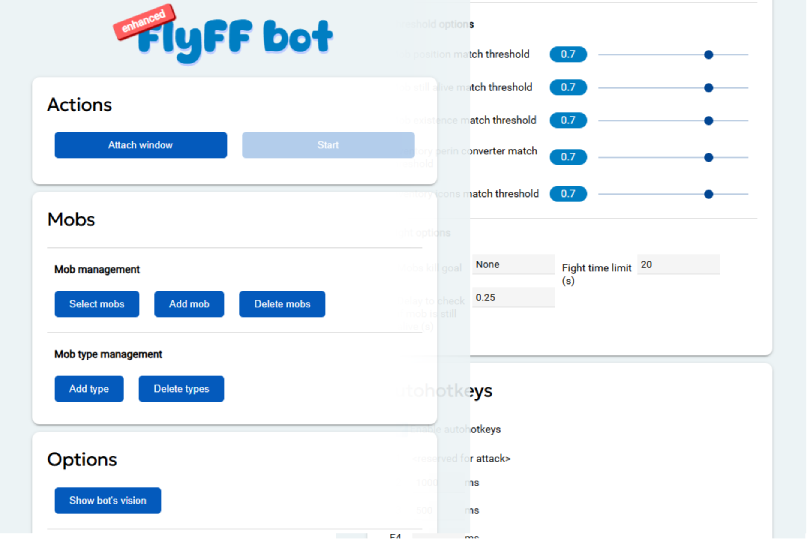
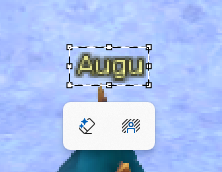

  

# About

Its detached fork of [xandao's flyff-bots](https://github.com/xandao-dev/flyff-bots) with some additional features, performance tweaks and user-friendly UI

  

# Key changes

- outdated pysimplegui replaced with modern RemiUI
- win32 executable, no longer need to manually install packages and run from source
- autohotkey configuration

# How to run

## Executable version

Just download latest version from [releases](https://github.com/JustMonk/enhanced-flyff-bots/releases) and run .exe

> Because of using win32 api and hotkey listening some antiviruses (like windows defender) may put the file to quarantine. If you want to use executable version, make sure you add file in exceptions

## From sources

1. Make sure you have installed python 3.10 (or install it)
2. `python -m venv venv`
3. `cd venv/Scripts`
4. `activate.bat`
5. `cd ../..`
6. `pip install -r requirements.txt`
7. `python ./app/standalone_app.py` or `python ./app/browser_app.py` (to run UI as browser page)

# Limitations

Right now, this only works with a game with a classic (white) interface. If your game has a newer (golden) UI, you need to manually replace the assets.

P.S: Auto-detection will be added later

# Getting started

## add new mob

1. take a screenshot and crop mob name, save it to any file with .png extension
    

      
    

2. press "add mob"
3. fill out the form
    - Mob name (this name will be shown in the list)
    - Location name (you can fill it in with any value, it just serves for convenience)
    - Image file (select the image file that you cropped earlier)
    - Height offset (the click area under the name, depends on the size of the mob and is usually in the range of 30 to 70)
    - Element (select the mob element that you took a screenshot of)
4. press "ok"

## select mob

The next stage is choosing which mobs will be used to search in the game
1. press "select mobs"
2. find the mobs you added earlier
3. select them
4. press "ok"

## turn on the bot

1. run the game
2. place your autoattack (or attack skill) to F1 hotkey
3. press "attach window" and select your game window from list
4. press "start" or use hotkey `alt+s` to stop

## add new types (elements)

If your game uses custom element icons, you can add them
1. take a screenshot and crop element icon, save it as .png
2. press "add type"
3. fill type name and select icon image
Now you can choose a custom element when adding mobs

P.S: It is not necessary to use the element icon specifically, it can be any marker of the selected target, the main requirement is that it does not change during the fight

## autohotkeys

Here is the list of F-buttons for which you can set the press interval.

The minimum interval is 100ms (if you set a lower value, this value will work as 100)

when the "enable hotkey" check box is on and bot started the following keys will be pressed at the specified interval

# Does it work with universe?

Currently nope. But I have some thoughts on how to make it work 

# License

Distributed under the MIT License. See [LICENSE](./LICENSE.md) for more information.
